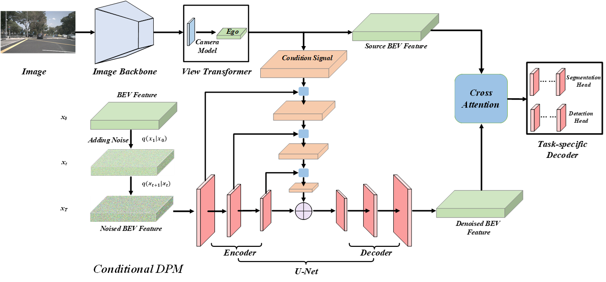
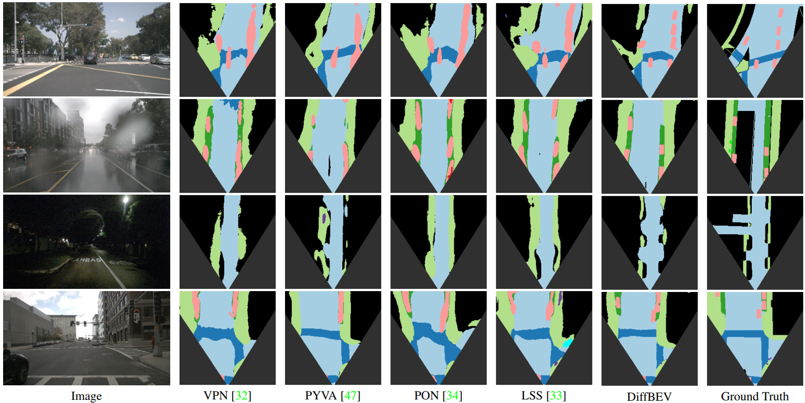

# [DiffBEV: Conditional Diffusion Model for Bird's Eye View Perception](https://arxiv.org/abs/2303.08333)
<div align="center">
Conditional diffusion probability model for BEV perception
</div>

---
<div align="center">
    <a href='https://arxiv.org/abs/2303.08333'>Arxiv
    <a href='https://github.com/JiayuZou2020/DiffBEV#abstract'>Abstract
    <a href='https://github.com/JiayuZou2020/DiffBEV#dataset'>Dataset
    <a href='https://github.com/JiayuZou2020/DiffBEV#installation'>Installation  
    <a href='https://github.com/JiayuZou2020/DiffBEV#visualization'>Visualization 
    <a href='https://github.com/JiayuZou2020/DiffBEV#citation'>Citation
    <a href='https://github.com/JiayuZou2020/DiffBEV#acknowledgement'>Acknowledgement
</div>

---

## Abstract
BEV perception is of great importance in the field of autonomous driving, serving as the cornerstone of planning, controlling, and motion prediction. The quality of the BEV feature highly affects the performance of BEV perception. However, taking the noises in camera parameters and LiDAR scans into consideration, we usually obtain BEV representation with harmful noises. Diffusion models naturally have the ability to denoise noisy samples to the ideal data, which motivates us to utilize the diffusion model to get a better BEV representation. In this work, we propose an end-to-end framework, named DiffBEV, to exploit the potential of diffusion model to generate a more comprehensive BEV representation. To the best of our knowledge, we are the first to apply diffusion model to BEV perception. In practice, we design three types of conditions to guide the training of the diffusion model which denoises the coarse samples and refines the semantic feature in a progressive way. What's more, a cross-attention module is leveraged to fuse the context of BEV feature and the semantic content of conditional diffusion model. DiffBEV achieves a 25.9% mIoU on the nuScenes dataset, which is 6.2% higher than the best-performing existing approach. Quantitative and qualitative results on multiple benchmarks demonstrate the effectiveness of DiffBEV in BEV semantic segmentation and 3D object detection tasks.

        
## Dataset
### Download Datasets From Official Websites
Extensive experiments are conducted on the _[nuScenes](https://www.nuscenes.org/download), _[KITTI Raw](https://www.cvlibs.net/datasets/kitti/raw_data.php)_, _[KITTI Odometry](https://www.cvlibs.net/datasets/kitti/eval_odometry.php)_, and _[KITTI 3D Object](https://www.cvlibs.net/datasets/kitti/eval_3dobject.php)_ benchmarks. 

### Prepare Depth Maps
Follow the [script](https://github.com/TRAILab/CaDDN/blob/master/pcdet/datasets/kitti/kitti_dataset.py) to generate depth maps for KITTI datasets. The depth maps of KITTI datasets are available at _[Google Drive](https://drive.google.com/drive/folders/1FR7SRXQw2TxVsjMn5SWel8sdfclWAtR8?usp=sharing)_ and _[Baidu Net Disk](https://pan.baidu.com/s/1ZCWPMSdmp33LsTBxZaETZQ?pwd=2023)_. We also provide the [script](https://github.com/JiayuZou2020/DiffBEV/blob/main/scripts/nuS2depth.py) to get the depth map for nuScenes dataset. Replace the dataset path in the script accroding to your dataset directory.

### Dataset Processing
After downing these datasets, we need to generate the annotations in BEV. Follow the instructions below to get the corresponding annotations. 
#### nuScenes
Run the script [make_nuscenes_labels](https://github.com/tom-roddick/mono-semantic-maps/blob/master/scripts/make_nuscenes_labels.py) to get the BEV annotation for the nuScenes benchmark. Please follow here to generate the BEV annotation (ann_bev_dir) for KITTI datasets. 

#### KITTI Datasets
Follow the _[instruction](https://github.com/manila95/monolayout#datasets)_ to get the BEV annotations for KITTI Raw, KITTI Odometry, and KITTI 3D Object datasets.

The datasets' structure is organized as follows.
```
data
├── nuscenes
    ├── img_dir
        ├── train
        ├── val
    ├── ann_bev_dir
        ├── train
        ├── val
        ├── train_depth
        ├── val_depth
    ├── calib.json
├── kitti_processed
    ├── kitti_raw
        ├── img_dir
            ├── train
            ├── val
        ├── ann_bev_dir
            ├── train
            ├── val
            ├── train_depth
            ├── val_depth
        ├── calib.json
    ├── kitti_odometry
        ├── img_dir
            ├── train
            ├── val
        ├── ann_bev_dir
            ├── train
            ├── val
            ├── train_depth
            ├── val_depth
        ├── calib.json
    ├── kitti_object
        ├── img_dir
            ├── train
            ├── val
        ├── ann_bev_dir
            ├── train
            ├── val
            ├── train_depth
            ├── val_depth
        ├── calib.json
```

### Prepare Calibration Files
For the camera parameters on each dataset, we write them into the corresponding _calib.json file. For each dataset, we upload the _calib.json to _[Google Drive](https://drive.google.com/drive/folders/1Ahaed1OsA1EqlJOCHHN-MQQr2VpF8H7U)_ and _[Baidu Net Disk](https://pan.baidu.com/s/1wEzHWkazS5vLPZJVjpzHMw?pwd=2022#list/path=%2F)_.

Please change the dataset path according to the real data directory in the _[nuScenes, KITTI Raw, KITTI Odometry, and KITTI 3D Object dataset configurations](https://github.com/JiayuZou2020/DiffBEV/tree/main/configs/_base_/datasets)_. Modify the path of pretrained model in _model configurations_.

## Installation
DiffBEV is tested on:
* Python 3.7/3.8
* CUDA 11.1
* Torch 1.9.1

Please check [install](https://github.com/open-mmlab/mmsegmentation/blob/master/docs/en/get_started.md#installation) for installation.
* Create a conda environment for the project.
```python
conda create -n diffbev python=3.7
conda activate diffbev
```
* Install Pytorch following the [instruction](https://pytorch.org/get-started/locally/).
`conda install pytorch torchvision -c pytorch`
* Install [mmcv](https://github.com/open-mmlab/mmcv)

```python
pip install -U openmim
mim install mmcv-full
```
* Git clone this repository
        
```python
git clone https://github.com/JiayuZou2020/DiffBEV.git
```

* Install and compile the required packages.
```python
cd mmsegmentation
pip install -v -e .
```

## Visualization


## Citation
If you find our work is helpful for your research, please consider citing as follows.
```
@article{zou2023diffbev,
      title={DiffBEV: Conditional Diffusion Model for Bird's Eye View Perception}, 
      author={Jiayu Zou and Zheng Zhu and Yun Ye and Xingang Wang},
      journal={arXiv preprint arXiv:2303.08333},
      year={2023}
}
```
## Acknowledgement
Our work is partially based on the following open-sourced projects: [mmsegmentation](https://github.com/open-mmlab/mmsegmentation), [VPN](https://github.com/pbw-Berwin/View-Parsing-Network), [PYVA](https://github.com/JonDoe-297/cross-view), [PON](https://github.com/tom-roddick/mono-semantic-maps), [LSS](https://github.com/nv-tlabs/lift-splat-shoot). 
Thanks for their contribution to the research community of BEV perception.
